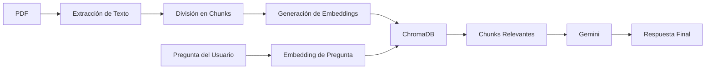

# 📄 Chat PDF con ChromaDB + Gemini + Streamlit

## 📖 Introducción

**Chat PDF** es una aplicación web interactiva que te permite "conversar" con tus documentos PDF. Sube cualquier PDF, haz preguntas en lenguaje natural y obtén respuestas precisas basadas en el contenido del documento. 

La aplicación utiliza técnicas avanzadas de **Retrieval-Augmented Generation (RAG)** para proporcionar respuestas contextuales y precisas, eliminando las "alucinaciones" típicas de los modelos de lenguaje al forzarlos a responder únicamente con información presente en el documento.

---

## ✨ ¿Por qué esta Stack Tecnológica?

### 🗄️ **ChromaDB**
ChromaDB es una base de datos vectorial de código abierto diseñada específicamente para aplicaciones de IA.

**Ventajas:**
- ⚡ **Configuración cero**: No requiere instalación de servidores ni configuraciones complejas
- 🚀 **Búsqueda semántica ultrarrápida**: Encuentra información relevante por significado, no solo por palabras clave
- 💾 **Eficiente en memoria**: Ideal para prototipos y aplicaciones locales
- 🔍 **Embeddings nativos**: Soporte integrado para vectores de alta dimensión
- 🎯 **Resultados precisos**: Recupera los fragmentos de texto más relevantes para cada pregunta

### 🤖 **Google Gemini**
Gemini es el modelo de lenguaje de última generación de Google, utilizado para generar respuestas naturales.

**Ventajas:**
- 🧠 **Comprensión avanzada**: Entiende contexto complejo y matices del lenguaje
- 💰 **Capa gratuita generosa**: Perfecto para desarrollo y proyectos pequeños
- ⚡ **Respuestas rápidas**: Modelo optimizado para baja latencia
- 🌍 **Multilingüe**: Soporte excelente para español y otros idiomas
- 🔒 **Control mediante prompts**: Fácil de configurar para evitar respuestas inventadas

### 🎨 **Streamlit**
Streamlit es un framework de Python para crear aplicaciones web de ciencia de datos de forma rápida.

**Ventajas:**
- 🐍 **100% Python**: No necesitas HTML, CSS ni JavaScript
- ⚡ **Desarrollo ultrarrápido**: De idea a aplicación funcional en minutos
- 🔄 **Recarga automática**: Los cambios se reflejan instantáneamente
- 📱 **Responsive por defecto**: Se adapta a diferentes dispositivos
- 🎨 **Componentes listos para usar**: File uploaders, botones, spinners y más

---

## 🏗️ Arquitectura del Proyecto

```
chatpdf/
│
├── app.py                  # Aplicación principal de Streamlit
├── requirements.txt        # Dependencias del proyecto
├── .env                    # Variables de entorno (API Keys)
├── pdfs/                   # Carpeta para documentos de prueba
└── README.md               # Este archivo
```

---

## 🔧 Requisitos Previos

### 📌 Versión de Python
Este proyecto requiere **Python 3.10.x** (recomendado: 3.10.11 o superior dentro de la serie 3.10).

Verifica tu versión de Python:
```bash
python --version
```

Si necesitas instalar Python 3.10:
- **Windows**: Descarga desde [python.org](https://www.python.org/downloads/)
- **macOS**: Usa Homebrew `brew install python@3.10`
- **Linux**: Usa el gestor de paquetes de tu distribución

### 🔑 API Key de Google Gemini
Necesitas una clave API de Google Gemini (gratuita):

1. Ve a [Google AI Studio](https://makersuite.google.com/app/apikey)
2. Inicia sesión con tu cuenta de Google
3. Haz clic en "Create API Key"
4. Copia la clave generada

---

## 🚀 Instalación y Configuración

### 1️⃣ Clonar el Repositorio

```bash
git clone <URL-de-tu-repositorio>
cd chatpdf
```

O si descargaste el proyecto como ZIP:
```bash
cd chatpdf
```

---

### 2️⃣ Crear Entorno Virtual

Es **altamente recomendado** usar un entorno virtual para aislar las dependencias del proyecto.

#### 🪟 **Windows (PowerShell)**

```powershell
# Crear entorno virtual
python -m venv .venv

# Activar entorno virtual
.\.venv\Scripts\Activate.ps1
```

Si tienes problemas de permisos en PowerShell:
```powershell
Set-ExecutionPolicy -ExecutionPolicy RemoteSigned -Scope CurrentUser
```

#### 🪟 **Windows (CMD)**

```cmd
# Crear entorno virtual
python -m venv .venv

# Activar entorno virtual
.venv\Scripts\activate.bat
```

#### 🍎 **macOS / Linux**

```bash
# Crear entorno virtual
python3.10 -m venv .venv

# Activar entorno virtual
source .venv/bin/activate
```

**Nota:** Una vez activado, verás `(.venv)` al inicio de tu línea de comandos.

---

### 3️⃣ Instalar Dependencias

Con el entorno virtual activado:

```bash
pip install --upgrade pip
pip install -r requirements.txt
```

**Dependencias principales:**
- `streamlit` → Framework web
- `chromadb` → Base de datos vectorial
- `pypdf` → Extracción de texto de PDFs
- `sentence-transformers` → Generación de embeddings locales
- `google-generativeai` → Cliente de Gemini
- `python-dotenv` → Gestión de variables de entorno

---

### 4️⃣ Configurar Variables de Entorno

Crea un archivo `.env` en la raíz del proyecto:

```bash
# Windows
echo GOOGLE_API_KEY=tu_api_key_aqui > .env

# macOS / Linux
echo "GOOGLE_API_KEY=tu_api_key_aqui" > .env
```

O créalo manualmente con tu editor favorito:

```
GOOGLE_API_KEY=AIzaSyXXXXXXXXXXXXXXXXXXXXXXXXXX
```

**⚠️ IMPORTANTE:** 
- Reemplaza `tu_api_key_aqui` con tu clave real de Gemini
- **NUNCA** compartas tu `.env` en repositorios públicos
- Añade `.env` a tu `.gitignore`

---

### 5️⃣ Ejecutar la Aplicación

Con el entorno virtual activado y las dependencias instaladas:

```bash
streamlit run app.py
```

La aplicación se abrirá automáticamente en tu navegador en:
```
http://localhost:8501
```

---

## 📘 Cómo Usar la Aplicación

1. **Sube un PDF** usando el botón de carga
2. **Procesa el documento** haciendo clic en "📥 Procesar PDF"
3. **Espera** mientras el sistema:
   - Extrae el texto del PDF
   - Divide el texto en fragmentos (chunks)
   - Genera embeddings vectoriales
   - Almacena los datos en ChromaDB
4. **Haz preguntas** en lenguaje natural sobre el contenido
5. **Obtén respuestas** precisas basadas en el documento
6. **Revisa el contexto** usado para generar cada respuesta (sección expandible)

---

## 🔍 Cómo Funciona (RAG Pipeline)



1. **Extracción**: PyPDF extrae texto página por página
2. **Chunking**: Texto dividido en fragmentos de 500 caracteres con solapamiento de 100
3. **Embeddings**: Modelo `all-MiniLM-L6-v2` convierte texto a vectores numéricos
4. **Almacenamiento**: ChromaDB indexa los vectores para búsqueda semántica
5. **Búsqueda**: Pregunta → Embedding → Top 4 chunks más similares
6. **Generación**: Gemini genera respuesta usando solo el contexto recuperado

---

## ⚙️ Personalización

### Ajustar el tamaño de chunks

En `app.py` línea 254, puedes modificar:

```python
chunks = chunk_text(text, chunk_size=500, overlap=100)
```

- **`chunk_size`**: Tamaño de cada fragmento (400-800 caracteres recomendado)
- **`overlap`**: Solapamiento entre fragmentos (10-20% del chunk_size)

### Cambiar el modelo de embeddings

En `app.py` línea 22, puedes usar otros modelos de [sentence-transformers](https://huggingface.co/sentence-transformers):

```python
EMBEDDING_MODEL = SentenceTransformer("all-MiniLM-L6-v2")
```

Opciones populares:
- `all-MiniLM-L6-v2` (rápido, ligero)
- `paraphrase-multilingual-MiniLM-L12-v2` (mejor para español)
- `all-mpnet-base-v2` (más preciso, más lento)

### Modificar el modelo de Gemini

En `app.py` línea 220:

```python
model = genai.GenerativeModel("models/gemini-2.5-flash-lite")
```

Otros modelos disponibles:
- `gemini-1.5-pro` (más potente)
- `gemini-1.5-flash` (balance precio-rendimiento)

---

## 🐛 Solución de Problemas

### ❌ Error: "Module not found"
```bash
# Asegúrate de tener el entorno virtual activado
pip install -r requirements.txt
```

### ❌ Error: "Invalid API Key"
- Verifica que tu `.env` existe y tiene la clave correcta
- Revisa que no haya espacios extra en el archivo `.env`
- Regenera tu API Key en Google AI Studio

### ❌ Error al procesar PDF
- Asegúrate de que el PDF no esté protegido con contraseña
- Verifica que el PDF contiene texto (no es solo imágenes escaneadas)

### ❌ La app no se abre en el navegador
```bash
# Abre manualmente en:
http://localhost:8501
```

---

## 📚 Recursos Adicionales

- [Documentación de Streamlit](https://docs.streamlit.io/)
- [ChromaDB Docs](https://docs.trychroma.com/)
- [Gemini API Documentation](https://ai.google.dev/docs)
- [Sentence Transformers](https://www.sbert.net/)
- [Modelos de Gemini y Precios](https://ai.google.dev/gemini-api/docs/pricing)
- [Límites de Rate de Gemini](https://ai.google.dev/gemini-api/docs/rate-limits)

---

## 🤝 Contribuciones

Las contribuciones son bienvenidas. Por favor:

1. Haz un Fork del proyecto
2. Crea una rama para tu feature (`git checkout -b feature/AmazingFeature`)
3. Commit tus cambios (`git commit -m 'Add some AmazingFeature'`)
4. Push a la rama (`git push origin feature/AmazingFeature`)
5. Abre un Pull Request

---

## 📄 Licencia

Este proyecto está bajo la Licencia MIT. Consulta el archivo `LICENSE` para más detalles.

---

## 👨‍💻 Autor

Desarrollado con ❤️ usando IA y las mejores prácticas de RAG.

---

## 🎯 Próximos Pasos Sugeridos

- [ ] Soporte para múltiples PDFs simultáneos
- [ ] Persistencia de la base de datos entre sesiones
- [ ] Exportar conversaciones en formato markdown
- [ ] Soporte para documentos escaneados (OCR)
- [ ] Interfaz multiidioma
- [ ] Sistema de historial de preguntas

---

**¿Preguntas o problemas?** Abre un Issue en el repositorio.
